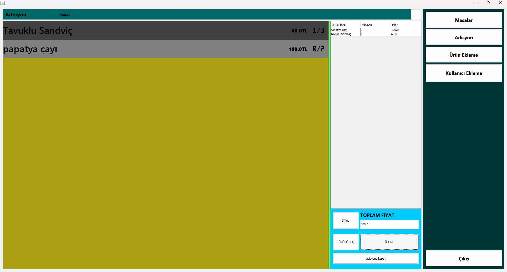
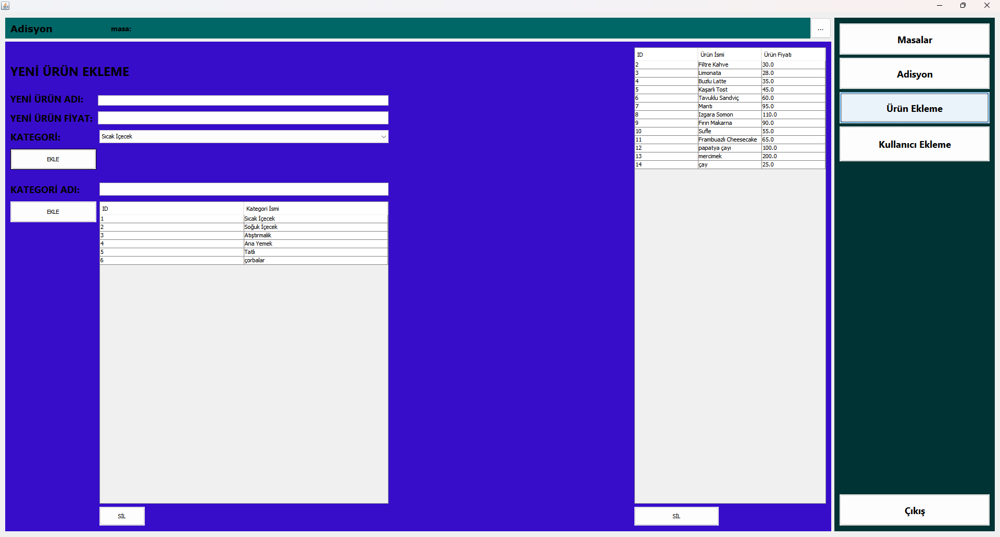
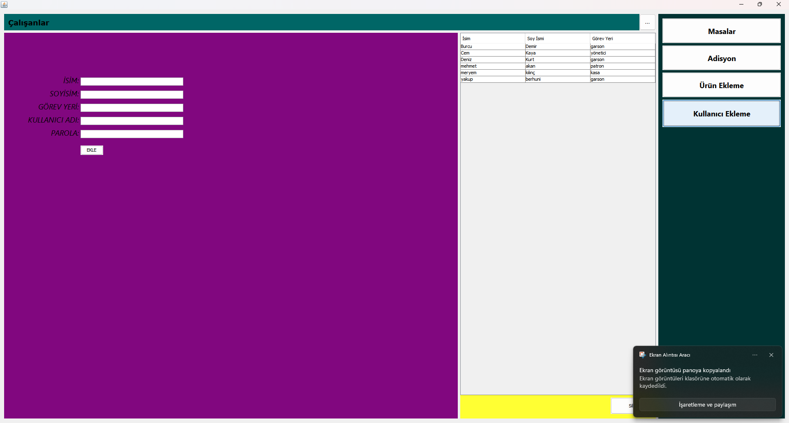

# 🧾 Adisyon Uygulaması

Bu proje, Java ile geliştirilen bir **adisyon yönetim sistemidir**. Garsonlar, masa üzerinden ürün ekleyebilir, güncelleyebilir ve adisyon takibi yapabilir. Arka planda veriler veritabanında saklanır.

## 🚀 Özellikler

- ✅ Masa bazlı adisyon oluşturma
- 🍽️ Ürün ekleme / silme / güncelleme
- 💰 Otomatik toplam hesaplama
- 🧑‍🍳 Kullanıcı dostu Swing arayüzü (Java GUI)
- 💾 Veritabanı bağlantısı (MySQL veya SQLite)

## 🖼️ Ekran Görüntüleri

> 📸 Login Arayüzü.
> 
> 📸 Masalar Arayüzü.
> 
> 📸 Adisyon Arayüzü.
> 
> 📸 Ürünler Arayüzü.
> 
> 📸 Çalışanlar Arayüzü.
> 

## 🧰 Kullanılan Teknolojiler

- Java 17+
- Swing (GUI)
- Gradle
- JDBC (MySQL / SQLite)
- NetBeans IDE

## ⚙️ Kurulum

1. Bu repoyu klonlayın:

```bash
git clone https://github.com/yakup6347/Adisyon.git
